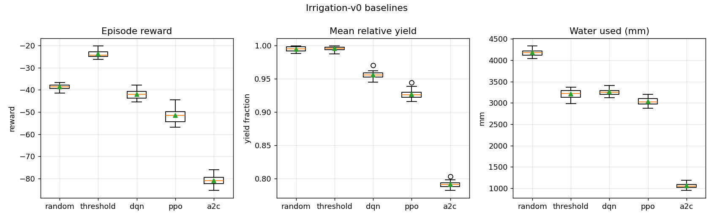
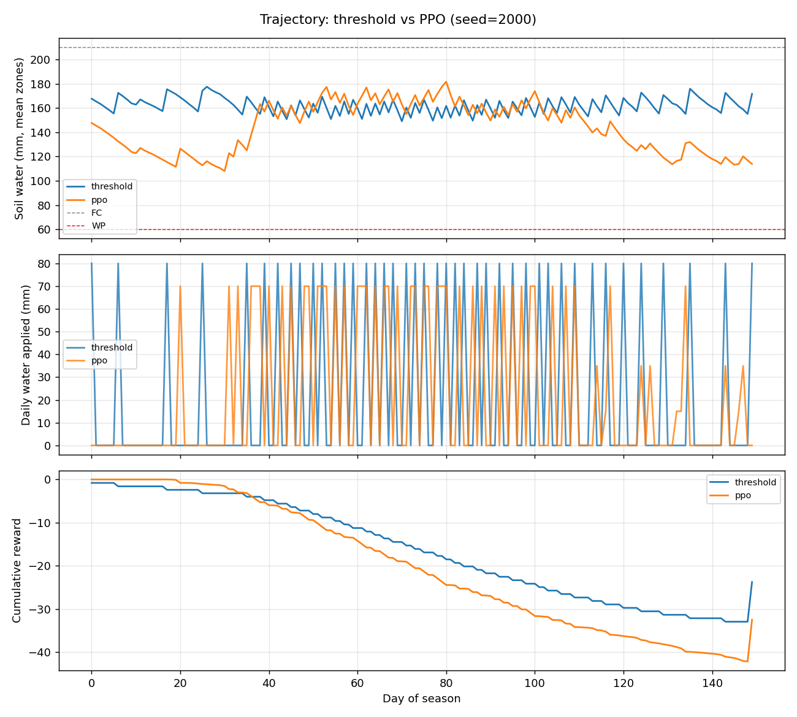
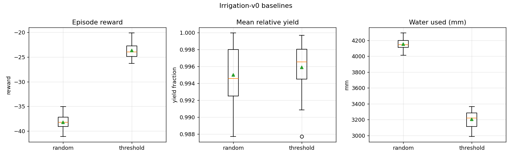

# LiveCrop — Irrigation Scheduling RL

[](https://colab.research.google.com/github/i221330/LiveCrop/blob/main/notebooks/irrigation_rl.ipynb)

A custom **Gymnasium environment** (`Irrigation-v0`) for multi-zone irrigation scheduling, benchmarked against **DQN, PPO, and A2C** from Stable-Baselines3.

**Portfolio artifact:** the environment and training pipeline — algorithms are off-the-shelf SB3.

---

## Problem

Agriculture consumes ~70% of global freshwater. An irrigation agent must decide how much water to allocate to each of 4 farm zones every day, balancing crop yield against water cost and waterlogging risk. The agent observes soil moisture, a short weather forecast, and the crop's growth stage, and must learn a seasonal policy under stochastic weather.

The environment implements a **simplified FAO-56 soil water balance** coupled to a **FAO-33 yield model**, with synthetic weather calibrated to Fresno, CA (California Central Valley).

---

## Quick start

```bash
pip install -r requirements.txt
pip install -e ".[train,plot,dev,gui]"

pytest                                                # verify environment
python3 -m agents.baselines --episodes 20             # run baselines
python3 -m agents.train --algo ppo --timesteps 200000 # train PPO
python3 -m agents.evaluate --algos ppo dqn a2c        # compare all agents
python3 -m agents.sweep --algo ppo --seeds 5          # seed sweep + ribbon plot
streamlit run app.py                                  # launch dashboard
```

```python
import gymnasium as gym
import irrigation_env  # registers Irrigation-v0

env = gym.make("Irrigation-v0")
obs, info = env.reset(seed=0)
obs, reward, terminated, truncated, info = env.step(env.action_space.sample())
```

---

## Environment spec

| | |
|---|---|
| **Observation** | `Box(18,)` — 4 zone moistures · 3-day forecast (rain/tmax/tmin/ET0) · crop Kc · season progress |
| **Action** | `Discrete(256)` — 4 zones × 4 water levels `{0, 5, 15, 25}` mm |
| **Episode length** | 150 days (May 1 – Sep 27) |
| **Reward** | `−water_cost − stress − waterlogging` per step, `+yield_bonus` at terminal |
| **Weather** | Fully synthetic AR(1) + Bernoulli rain calibrated to Fresno 1991–2020 normals |
| **Soil model** | FAO-56 water balance per zone (mm of root-zone depth) |
| **Yield model** | FAO-33 piecewise Ky aggregation |

---

## Results

DQN, PPO, and A2C trained for 500k steps (seed 42); evaluated on 30 held-out seeds (2000–2029):

| Policy | Reward | Yield | Water (mm/season) |
|---|---|---|---|
| Threshold heuristic | **−23.9** | 0.995 | 3 180 |
| PPO | −31.6 | 0.969 | 2 911 |
| DQN | −33.9 | 0.973 | 3 197 |
| Random | −38.3 | 0.994 | 4 138 |
| A2C | −109 | 0.690 | 0 |

**PPO and DQN beat the random baseline** and use 25–30% less water. The threshold heuristic, which encodes domain knowledge (FAO-56 soil balance + rain forecast lookahead), remains the strongest policy at this step budget — consistent with the literature on sparse-reward scheduling problems where expert knowledge is hard to recover from data alone in <1M steps.

**A2C diverged** to a degenerate no-water policy, demonstrating its sensitivity to the absence of PPO's trust-region clipping in high-variance advantage estimates. This contrast between PPO and A2C is itself a result worth noting.



PPO vs threshold — one full season (seed 2000):



Baselines — random vs moisture-threshold (30 seeds):



---

## Repo layout

```
irrigation_env/        Gymnasium env + FAO-56 dynamics + synthetic weather
agents/
  baselines.py         random + moisture-threshold reference policies
  train.py             unified SB3 training script (DQN / PPO / A2C)
  evaluate.py          load saved models, run seed sweeps, produce plots
  sweep.py             multi-seed sweep with learning-curve ribbon plot
app.py                 Streamlit dashboard — Simulate / Compare / Tune tabs
configs/
  env.yaml             env physics + reward weights
  agents.yaml          SB3 hyperparameters (tune here, not in code)
tests/                 15 invariant tests (API, determinism, physics bounds)
notebooks/             Colab-ready end-to-end demo
results/plots/         tracked portfolio plots
```

---

## Roadmap

- [x] Week 1 — custom env, FAO-56/33 dynamics, 15 tests, random + heuristic baselines
- [x] Week 2 — DQN/PPO/A2C training scripts, evaluation pipeline, Colab notebook
- [x] Week 3 — train all agents on Colab, generate comparison + trajectory plots
- [x] Week 4 — hyperparameter config file, seed sweep with ribbon plot, README polish
- [x] Week 5 — zone heterogeneity, calibrated reward config, dashboard, final portfolio review

---

## License

MIT
